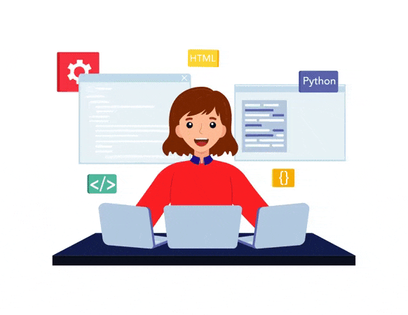

# Portfolio

Welcome to my portfolio! This is a showcase of my work and skills as a developer. Here, you can explore the projects I've worked on, get to know more about my background, and see the technologies and tools I've used.

## About Me

I am a passionate developer with a strong interest in creating innovative solutions and tackling complex challenges. My background includes experience in full-stack development, from building dynamic web applications to managing databases and deploying applications.

## Purpose

The purpose of this portfolio is to provide a comprehensive overview of my skills and projects. Whether you’re interested in seeing my work, learning about my expertise, or exploring potential collaboration opportunities, this portfolio aims to give you a clear picture of my abilities and achievements.

## Projects

In the "Projects" section, you will find a variety of projects showcasing different aspects of my work:

- **KBA Course App**: A web application showcasing blockchain-related courses.
- **AssetPro**: An IT asset management tool designed for efficient tracking and management.
- **CookBook**: A recipe book featuring a collection of delicious and easy-to-make dishes.
- **Electricity Bill Management System**: A system for managing and tracking electricity bills.
- **Blog App**: A platform for creating and managing blog posts.
- **Employee Management App**: An application for managing employee information and records.

Each project includes a brief description, a link to the code repository, and an image to give you a visual sense of the project.

## Skills

In addition to the projects, you’ll find information about the skills and technologies I’ve worked with, including:

- **Frontend Development**: React, HTML, CSS, Tailwind CSS
- **Backend Development**: Node.js, Express.js
- **Database Management**: MongoDB
- **Version Control**: Git, GitHub
- **Deployment**: Docker, Heroku, Vercel

## Navigation

Feel free to explore the different sections of my portfolio:

- **Projects**: View detailed information about each project.
- **Skills**: Learn about the technologies and tools I am proficient in.
- **Contact**: Reach out if you’d like to discuss opportunities or collaborate.

## Contact


## Getting Started

### Prerequisites

Make sure you have the following installed:

- [Node.js](https://nodejs.org/)
- [npm](https://www.npmjs.com/) 

### Installation

1. Clone the repository:

   ```bash
   git clone https://github.com/Neethu_Muthu/NEETHU_PROTFOLIO_USING_REACT.git
   ```

2. Navigate to the project directory:

   ```bash
   cd portfolio
   ```

3. Install the dependencies:

   ```bash
   npm install
   ```

### Running the Project

To start the development server, run:

```bash
npm start
```


The website will be available at `http://localhost:3000`.

## Contributing

Contributions are welcome! Please fork the repository and create a pull request with your changes.
